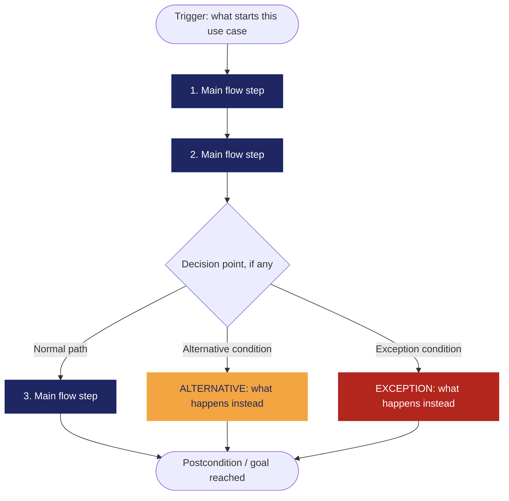

<!--
HOW TO USE THIS TEMPLATE
------------------------
1. Copy this file and rename it to the requirement's ID, e.g. REQ-01.md.
2. Fill in every section. If a section genuinely does not apply to this
   requirement (not every requirement has a Business Rule or a Constraint),
   write "N/A — none identified" and say why in one line. Never invent
   content to fill a blank cell — that breaks the rule we've followed since
   Class 8: specification is not invention.
3. If something is unknown rather than inapplicable, use the Open
   Questions section instead of guessing.
4. See REQ-07_Example.md (Food Delivery System) for a fully filled-in
   reference before you start.
-->

# [REQ-ID] — [Short Requirement Title]

| Campo | Detalle |
|---|---|
| **Estado** | Propuesto |
| **Equipo / Autores** | Junior Andrés Arrieta Tabaco, Edgar Mauricio Montufar Molano, Kevin Alexis Bermúdez Caicedo y Antonio José Moreno López |
| **Fecha** | 2026-10-10 |
| **Historia de usuario / Criterios de aceptación vinculados** | HU-04, CA-01, CA-02, CA-03, CA-04 |

---

## 1. Descripción general

**Declaración de requisitos**

> El sistema debe bloquear temporalmente el acceso de un usuario durante cinco minutos después de cinco intentos consecutivos de autenticación fallidos. Durante este período, el sistema debe impedir que el usuario vuelva a autenticarse.

**Tipo:** No funcional (*Seguridad*).

Este requisito busca proteger el acceso al sistema mediante un mecanismo de bloqueo temporal después de múltiples intentos consecutivos de autenticación fallidos. Aunque establece un comportamiento específico que puede verificarse mediante pruebas, su propósito principal es fortalecer la seguridad del sistema.

**Fuente / evidencia**

> Documentación de requisitos del proyecto — RNF-01: «Bloquear acceso tras intentos fallidos», HU-04 y criterios de aceptación CA-01, CA-02, CA-03 y CA-04.

El requisito fue definido por el equipo durante la elaboración de los requisitos del sistema como una medida de seguridad para proteger el acceso de los usuarios. No se realizaron entrevistas para identificar esta necesidad.

**Necesidad**

> Proteger el acceso a las cuentas de usuario y limitar los intentos de autenticación después de cinco intentos consecutivos fallidos.

**Valor / Justificación**

> Reducir el riesgo de intentos reiterados de acceso no autorizado mediante el bloqueo temporal de la autenticación después de cinco intentos consecutivos fallidos.

---

## 2. Context — A Requirement Rarely Stands Alone

*(Class 10. Fill honestly — "N/A — none identified" is a valid, expected answer for several of these.)*

**Business Rule(s)**
> What rule(s) exist in the business/domain, independent of software, that this requirement supports or enforces? Remember: Business Rule ≠ Software Requirement — not every rule needs one.

**Constraint(s)**
> What limits how this requirement can be solved (regulation, existing technology, contract, interoperability, organizational policy)? A constraint reduces the available design space — it doesn't describe what must be satisfied, it describes what limits the solution.

**Assumption(s)**
> What are we currently treating as true, without full verification, to keep moving? (Assumption ≠ Fact.)

**Dependenc(ies)**
> What does this requirement rely on to be satisfied (another requirement, an external system/API, a data source, a third party, an organizational process)?

**Risk(s)**
> What uncertain event or condition could negatively affect this requirement or its delivery? For each risk, note a rough Likelihood and Impact (High / Medium / Low) and, if you have one, a brief mitigation note.

| Risk | Likelihood | Impact | Mitigation (optional) |
|---|---|---|---|
| | | | |

**Open Questions**
> Anything still unresolved — ambiguity, a question no stakeholder has answered yet, a missing piece of evidence. List it here instead of guessing.

---

## 3. Priority & Estimation

**Priority model used:** MoSCoW / Kano / RICE / WSJF / Value-Effort *(pick the one that fits the decision you're actually making — see Class 10's comparison if you need to decide which)*

**Priority assigned:**
> Because [the situation/signal from your project], we assigned [priority value], accepting the trade-off of [what you're giving up by not prioritizing it higher/lower]. We considered [alternative priority] and didn't use it because [reason].

**Estimate (confidence):** High / Medium / Low
> How sure are we about the size and shape of this work? *(This is a confidence tag, not a technique-based number — named estimation techniques like story points are Ingeniería de Software II content, not this course.)*

---

---------------

## 4. Representaciones — El requisito no es la representación

### 4.1 Historia de usuario

> Como usuario del sistema, quiero que mi acceso sea bloqueado temporalmente después de cinco intentos consecutivos de autenticación fallidos, para proteger el acceso a mi cuenta ante múltiples intentos fallidos.

*Verificación:* La historia de usuario expresa el objetivo de seguridad que necesita el usuario, mientras que el bloqueo durante cinco minutos después de cinco intentos fallidos establece el comportamiento esperado del sistema.

### 4.2 Criterios de aceptación

**Escenario 1 — Bloqueo después de cinco intentos fallidos**

> Dado que un usuario intenta autenticarse en el sistema, cuando alcanza cinco intentos consecutivos de autenticación fallidos, entonces el sistema bloquea temporalmente su acceso durante cinco minutos.

**Escenario 2 — Intento de autenticación durante el bloqueo**

> Dado que el acceso de un usuario se encuentra bloqueado, cuando intenta autenticarse durante el período de bloqueo, entonces el sistema impide temporalmente el acceso.

**Escenario 3 — Finalización del bloqueo**

> Dado que el acceso de un usuario se encuentra bloqueado, cuando transcurren cinco minutos desde el inicio del bloqueo, entonces el sistema finaliza el período de bloqueo temporal y permite que el usuario vuelva a intentar autenticarse.

**Escenario 4 — Persistencia del bloqueo durante el período establecido**

> Dado que un usuario ha alcanzado cinco intentos consecutivos de autenticación fallidos, cuando intenta autenticarse antes de que finalicen los cinco minutos de bloqueo, entonces el sistema mantiene la restricción de acceso.

### 4.3 Caso de uso

| **Campo** | **Descripción** |
|---|---|
| **Nombre del caso de uso** | Bloquear acceso tras intentos fallidos |
| **Actor** | Usuario del sistema |
| **Objetivo** | Proteger el acceso al sistema mediante un bloqueo temporal después de cinco intentos consecutivos de autenticación fallidos. |
| **Desencadenante** | El usuario realiza un intento de autenticación. |
| **Precondición** | El usuario se encuentra registrado en el sistema y está intentando autenticarse. |

**Flujo principal**

1. El usuario ingresa sus credenciales de autenticación.
2. El sistema recibe las credenciales ingresadas.
3. El sistema verifica las credenciales y determina que la autenticación es fallida.
4. El sistema registra el intento fallido consecutivo.
5. El usuario continúa realizando intentos de autenticación fallidos.
6. El sistema registra los intentos fallidos consecutivos.
7. El usuario realiza el quinto intento consecutivo de autenticación fallido.
8. El sistema identifica que se han alcanzado cinco intentos consecutivos fallidos.
9. El sistema bloquea temporalmente el acceso del usuario durante cinco minutos.
10. El sistema informa que el acceso se encuentra temporalmente bloqueado.

**Flujo alternativo**

> **Autenticación exitosa antes de alcanzar cinco intentos fallidos: si el usuario ingresa credenciales válidas antes de alcanzar cinco intentos consecutivos fallidos, el sistema permite el acceso y reinicia el contador de intentos fallidos a cero.

**Excepción**

> **Intento de autenticación durante el bloqueo:** si el usuario intenta autenticarse antes de que transcurran los cinco minutos, el sistema impide el acceso y mantiene el bloqueo temporal.

**Postcondición**

> El acceso del usuario permanece bloqueado durante cinco minutos después de alcanzar cinco intentos consecutivos de autenticación fallidos. Una vez finalizado el período, el sistema permite que el usuario vuelva a intentar autenticarse.

----------------

## 4. Representations — Requirement ≠ Representation

*(Class 9. Each representation reveals different information. Fill in all three below — for this capstone requirement, all three are required.)*

### 4.1 User Story

> As a **[role]**,
> I want **[capability]**,
> so that **[value]**.

*Check yourself: is the "I want" describing the need, or already prescribing a solution?*

### 4.2 Acceptance Criteria

*(At least two scenarios: one normal path, one alternative or exception.)*

**Scenario 1 — [short name]**
> **Given** [context]
> **When** [event/stimulus]
> **Then** [observable outcome]

**Scenario 2 — [short name, alternative or exception]**
> **Given** [context]
> **When** [event/stimulus]
> **Then** [observable outcome]

### 4.3 Use Case

| Field | |
|---|---|
| **Use Case name** | |
| **Actor** | |
| **Goal** | |
| **Trigger** | |
| **Precondition** | |

**Main Flow**
1.
2.
3.
4.

**Alternative Flow**
> [Condition] → [what happens instead]

**Exception**
> [Condition] → [what happens instead]

**Postcondition**
>

**Flow Diagram**
*(Replace the labels below with your own steps. Keep Main Flow, Alternative, and Exception visually distinct — delete whichever branch doesn't apply to your use case. This renders automatically on GitHub.)*

---

## 5. Traceability & Impact

*(Class 10. Conceptual, not a formal matrix.)*

**Backward — why does this requirement exist?**
> Evidence → Need → Requirement. Point to the specific evidence/need entries that justify this requirement (from your Discovery Sheet).

**Forward — what will this affect?**
> Requirement → future Design → Implementation → Tests. *(It's fine if Design hasn't happened yet — note what you expect this to touch once it does, and update this section once Class 11 work begins.)*

**Impact Analysis — if this requirement changes, what else might need to change?**
- [ ] Business Rules
- [ ] Constraints
- [ ] Dependencies
- [ ] Risks
- [ ] Acceptance Criteria
- [ ] Estimate
- [ ] Priority
- [ ] Future Design
- [ ] Future Tests

> Briefly note which of the above are actually likely to be affected, and why.

---

## 6. Validation — Quality Gate

*(Class 9 + Class 10. Self-audit before you commit this file. Check honestly — a "no" here means the requirement isn't ready yet, not that you should force a checkmark.)*

- [ ] **Valid?** Does it reflect a real, evidenced need — not an invented one?
- [ ] **Clear / Unambiguous?** Is there only one reasonable interpretation?
- [ ] **Atomic?** Is this one independently testable expectation, not several bundled together?
- [ ] **Necessary?** Does removing it actually break something real?
- [ ] **Feasible?** Can this realistically be built with what the team has?
- [ ] **Verifiable?** Can you demonstrate, concretely, whether it's satisfied?
- [ ] **Consistent?** Does it conflict with any other requirement in your set?
- [ ] **Complete enough?** Are there important functions or constraints still missing?
- [ ] **Traceable?** Can every part of this document be traced back to real evidence — not invented to fill a section?

> If any box is unchecked, say what's missing and whether it becomes an Open Question or sends you back to Class 8 (re-elicit) or Class 9 (re-specify).
