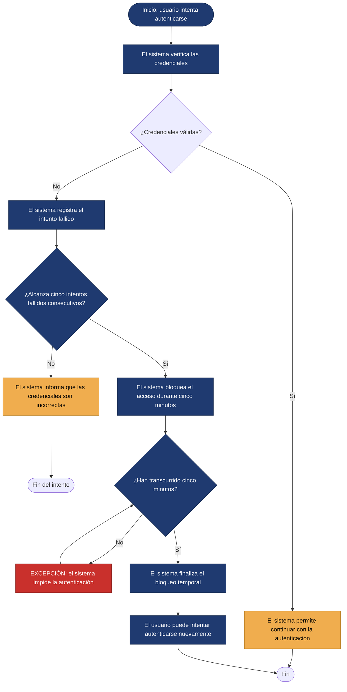

<!--
HOW TO USE THIS TEMPLATE
------------------------
1. Copy this file and rename it to the requirement's ID, e.g. REQ-01.md.
2. Fill in every section. If a section genuinely does not apply to this
   requirement (not every requirement has a Business Rule or a Constraint),
   write "N/A — none identified" and say why in one line. Never invent
   content to fill a blank cell — that breaks the rule we've followed since
   Class 8: specification is not invention.
3. If something is unknown rather than inapplicable, use the Open
   Questions section instead of guessing.
4. See REQ-07_Example.md (Food Delivery System) for a fully filled-in
   reference before you start.
-->

# REQ-RF-03 — Bloquear acceso tras intentos fallidos

| Atributo | Detalle |
|---|---|
| **Estado** | Evaluado |
| **Equipo / Autores** | Junior Andrés Arrieta Tabaco, Kevin Alexis Bermúdez Caicedo, Edgar Mauricio Montufar Molano y Antonio José Moreno López |
| **Fecha** | 2026-10-09 |
| **Historia de usuario / Criterios de aceptación vinculados** | HU-04, CA-01, CA-02, CA-03, CA-04 |

---

## 1. Descripción general

**Declaración de requisitos**

> El sistema debe bloquear temporalmente el acceso de un usuario durante cinco minutos después de cinco intentos consecutivos de autenticación fallidos. Durante este período, el sistema debe impedir que el usuario vuelva a autenticarse.

**Tipo:** Funcional (*Seguridad*).

Este requisito busca proteger el acceso al sistema mediante un mecanismo de bloqueo temporal después de múltiples intentos consecutivos de autenticación fallidos. Aunque establece un comportamiento específico que puede verificarse mediante pruebas, su propósito principal es fortalecer la seguridad del sistema.

**Fuente / evidencia**

> Documentación de requisitos del proyecto — RF-03: «Bloqueo temporal de acceso por intentos fallidos», HU-04 y criterios de aceptación CA-01, CA-02, CA-03 y CA-04.

El requisito fue definido por el equipo durante la elaboración de los requisitos del sistema como una medida de seguridad para proteger el acceso de los usuarios. No se realizaron entrevistas para identificar esta necesidad.

**Necesidad**

> Proteger el acceso a las cuentas de usuario y limitar los intentos de autenticación después de cinco intentos consecutivos fallidos.

**Valor / Justificación**

> Reducir el riesgo de intentos reiterados de acceso no autorizado mediante el bloqueo temporal de la autenticación después de cinco intentos consecutivos fallidos.

---
## 2. Contexto

**Reglas de negocio**
> **RN-01 (Límite de autenticación de usuario):** Una cuenta de usuario solo puede acumular un máximo de 5 intentos fallidos de autenticación consecutivos antes de ser restringida temporalmente para evitar accesos no autorizados.

> **RN-02 (Reinicio del conteo por evento exitoso):** Un intento de autenticación exitoso restablece inmediatamente a cero el contador de intentos fallidos acumulados previamente por el usuario.

**Restricciones**
> **REST-01 (Gestión en el servidor / Backend):** La lógica del temporizador de 5 minutos, el contador de intentos y el bloqueo deben ser procesados y validados exclusivamente en el lado del servidor (*backend*) para evitar que el cliente o navegador pueda omitir la restricción alterando datos locales.

**Supuestos**
> **SUP-01 (Sincronización horaria del servidor):** Se asume que el servidor cuenta con un servicio de tiempo (NTP) activo y sincronizado para calcular con precisión la ventana de bloqueo de 5 minutos.
> **SUP-02 (Existencia previa de la cuenta):** Se asume que los intentos de autenticación evaluados corresponden a usuarios previamente registrados y activos en el sistema farmacéutico.

**Dependencias**
> **DEP-01 (Servicio de Autenticación):** El mecanismo de bloqueo depende directamente del servicio central de autenticación/login encargado de procesar y validar las credenciales de entrada.

**Riesgos**

| Riesgo | Probabilidad | Impacto | Mitigación (opcional) |
|---|---|---|---|
| **Ataque de Denegación de Servicio (DoS) dirigido a usuarios legítimos:** Un atacante puede forzar intencionadamente 5 intentos fallidos con el correo de un usuario válido para denegarle el acceso. | Media | Alto |  Evaluar la implementación de un CAPTCHA desde el primer intento para dificultar los intentos automatizados. |
| **Finalización incorrecta del bloqueo temporal:** El sistema podría mantener una cuenta bloqueada después de que hayan transcurrido los cinco minutos establecido, impidiendo que el usuario vuelva a intentar autenticarse | Baja | Alto | Validar en el backend el tiempo transcurrido desde el inicio del bloqueo y permitir nuevos intentos cuando haya finalizado el período establecido. |
| **Perdida del contador de intentos fallidos:** Si el contador se almacena únicamente en la memoria temporal, un reinicio del servidor o un cambio de instancia podría hacer que se pierdan los intentos acumulados | Media | Alto | Almacenar el contador en un mecanismo de mayor persistencia y comprobar su estado después del reinicio. |

**Preguntas abiertas (Open Questions)**
> N/A — Ninguna identificada.

---
## 3. Prioridad y estimación

**Modelo de priorización utilizado:** MoSCoW

**Prioridad asignada:**

> Debido a que el sistema gestiona el acceso a la información del inventario farmacéutico, asignamos la prioridad **Must have (Imprescindible)** al bloqueo temporal después de cinco intentos consecutivos de autenticación fallidos. Esta funcionalidad establece una medida de protección frente a intentos repetidos de acceso y contribuye a la seguridad del sistema.
>
> Consideramos la categoría **Should have (Debería tener)**, pero la descartamos porque aplazar esta funcionalidad dejaría sin implementar la medida de protección definida para la autenticación. Por esta razón, priorizamos el bloqueo temporal y las pruebas necesarias para verificar su funcionamiento frente a mejoras secundarias que no afecten directamente al control de acceso.

**Estimación (confianza):** Media (Medium)

> El requisito define claramente las condiciones principales del bloqueo: cinco intentos consecutivos de autenticación fallidos y una duración de cinco minutos. La confianza de la estimación es media porque, aunque el comportamiento esperado está delimitado, su implementación requiere considerar el registro de intentos fallidos, el control del tiempo de bloqueo y la verificación de que el acceso vuelva a estar disponible al finalizar dicho período.

---
## 4. Representaciones — El requisito no es la representación

### 4.1 Historia de usuario

> Como usuario del sistema, quiero que mi acceso sea bloqueado temporalmente después de cinco intentos consecutivos de autenticación fallidos, para proteger el acceso a mi cuenta ante múltiples intentos fallidos.

*Verificación:* La historia de usuario expresa el objetivo de seguridad que necesita el usuario, mientras que el bloqueo durante cinco minutos después de cinco intentos fallidos establece el comportamiento esperado del sistema.

### 4.2 Criterios de aceptación

**Escenario 1 — Bloqueo después de cinco intentos fallidos**

> Dado que un usuario intenta autenticarse en el sistema, cuando alcanza cinco intentos consecutivos de autenticación fallidos, entonces el sistema bloquea temporalmente su acceso durante cinco minutos.

**Escenario 2 — Intento de autenticación durante el bloqueo**

> Dado que el acceso de un usuario se encuentra bloqueado, cuando intenta autenticarse durante el período de bloqueo, entonces el sistema impide temporalmente el acceso.

**Escenario 3 — Finalización del bloqueo**

> Dado que el acceso de un usuario se encuentra bloqueado, cuando transcurren cinco minutos desde el inicio del bloqueo, entonces el sistema finaliza el período de bloqueo temporal y permite que el usuario vuelva a intentar autenticarse.

**Escenario 4 — Persistencia del bloqueo durante el período establecido**

> Dado que un usuario ha alcanzado cinco intentos consecutivos de autenticación fallidos, cuando intenta autenticarse antes de que finalicen los cinco minutos de bloqueo, entonces el sistema mantiene la restricción de acceso.

### 4.3 Caso de uso

| **Campo** | **Descripción** |
|---|---|
| **Nombre del caso de uso** | Bloquear acceso tras intentos fallidos |
| **Actor** | Usuario del sistema |
| **Objetivo** | Proteger el acceso al sistema mediante un bloqueo temporal después de cinco intentos consecutivos de autenticación fallidos. |
| **Desencadenante** | El usuario realiza un intento de autenticación. |
| **Precondición** | El usuario se encuentra registrado en el sistema y está intentando autenticarse. |

**Flujo principal**

1. El usuario ingresa sus credenciales de autenticación.
2. El sistema recibe las credenciales ingresadas.
3. El sistema verifica las credenciales y determina que la autenticación es fallida.
4. El sistema registra el intento fallido consecutivo.
5. El usuario continúa realizando intentos de autenticación fallidos.
6. El sistema registra los intentos fallidos consecutivos.
7. El usuario realiza el quinto intento consecutivo de autenticación fallido.
8. El sistema identifica que se han alcanzado cinco intentos consecutivos fallidos.
9. El sistema bloquea temporalmente el acceso del usuario durante cinco minutos.
10. El sistema informa que el acceso se encuentra temporalmente bloqueado.

**Flujo alternativo**

> **Autenticación exitosa antes de alcanzar cinco intentos fallidos:** si el usuario ingresa credenciales válidas antes de alcanzar cinco intentos consecutivos fallidos, el sistema permite el acceso y reinicia el contador de intentos fallidos a cero.

**Excepción**

> **Intento de autenticación durante el bloqueo:** si el usuario intenta autenticarse antes de que transcurran los cinco minutos, el sistema impide el acceso y mantiene el bloqueo temporal.

**Postcondición**

> El acceso del usuario permanece bloqueado durante cinco minutos después de alcanzar cinco intentos consecutivos de autenticación fallidos. Una vez finalizado el período, el sistema permite que el usuario vuelva a intentar autenticarse.

**Diagrama de flujo**

---
## 5. Trazabilidad e impacto

**Trazabilidad hacia atras — ¿Por qué existe este requisito?**

> HU-04 — Necesidad de proteger el acceso a la cuenta frente a múltiples intentos fallidos → RF-03 — Bloqueo temporal de acceso por intentos fallidos → CA-01, CA-02, CA-03 y CA-04 → CU-03 — Bloquear acceso tras intentos fallidos.

La historia de usuario expresa la necesidad de seguridad que origina el requisito. Los criterios de aceptación especifican las condiciones que permiten verificar su cumplimiento, mientras que el caso de uso describe el flujo de interacción relacionado con el bloqueo temporal. El ADR-0001 establece el alcance general del sistema de inventario farmacéutico, pero no constituye evidencia específica del origen de este requisito.

**Trazabilidad hacia adelante — ¿Que va a afectar esto?**

> RF-03 → Diseño futuro (mecanismo de autenticación, contador de intentos fallidos y control temporal del bloqueo) → Implementación futura (lógica de autenticación y gestión del estado de bloqueo) → Pruebas (verificación de los cinco intentos fallidos, el bloqueo durante cinco minutos y la recuperación del acceso).

**Análisis de impacto: si este requisito cambia, ¿qué más podría tener que cambiar?**

- [x] Reglas de negocio
- [x] Restricciones
- [x] Dependencias
- [x] Riesgos
- [x] Criterios de aceptacion
- [ ] Estimacion
- [ ] Prioridad
- [x] Diseño futuro
- [x] Pruebas futuras

> Si cambia el mecanismo de autenticación o la política de bloqueo temporal, las reglas de negocio, las restricciones, las dependencias y los riesgos deberán revisarse. También podrían cambiar los criterios de aceptación si se modifica el número de intentos fallidos o la duración del bloqueo. El diseño futuro y las pruebas deberán actualizarse para mantener el comportamiento esperado. La estimación y la prioridad se dejan sin marcar porque no se cuenta con una estimación previa ni con una decisión de priorización documentada que permita afirmar que cambiarían.

---

## 6. Validación — Criterios de calidad

- [x] **¿Valido?** Refleja una necesidad real y evidenciada, y no una inventada?
- [x] **¿Es claro y no ambiguo?** Solo hay una interpretación razonable?
- [x] **¿Es atomico?** ¿Describe una expectativa que puede comprobarse de manera independiente, en lugar de agrupar varias funcionalidades distintas?
- [x] **¿Es necesario?** ¿Removerla afectaría una necesidad real del sistema?
- [x] **¿Es factible?** ¿Puede implementarse de manera realista con los recursos y la tecnología disponibles para el equipo?
- [x] **¿Es verificable?** ¿Se puede demostrar de forma concreta si se cumple o no?
- [x] **¿Es consistente?** ¿Evita entrar en conflicto con los demás requisitos definidos?
- [x] **¿Esta suficientemente completo?** ¿Se han definido las funciones y restricciones importantes?
- [x] **¿Es traceable?** ¿Cada parte del documento puede relacionarse con evidencia real, en lugar de haberse inventado para completar una sección?

> El requisito cuenta con una necesidad documentada en la HU-04, un objetivo de seguridad explícito y una relación directa con los criterios de aceptación CA-01 a CA-04 y el caso de uso CU-03. Su comportamiento principal es claro, se concentra en una regla de seguridad y puede verificarse mediante pruebas basadas en los cinco intentos consecutivos fallidos y los cinco minutos de bloqueo. Además, la funcionalidad es técnicamente razonable, aunque su implementación definitiva dependerá de la arquitectura y del mecanismo de autenticación del sistema. Los elementos revisados mantienen coherencia entre sí y permiten seguir la trazabilidad interna del requisito.
